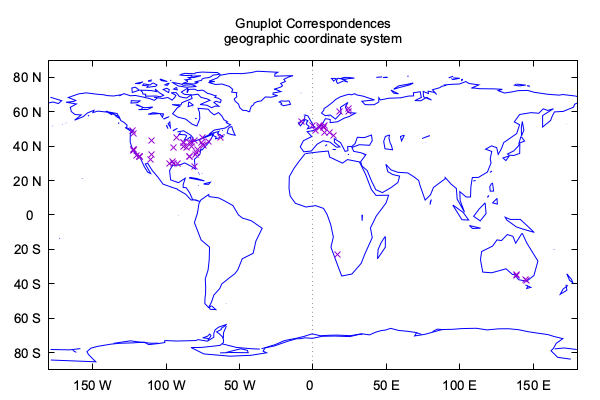
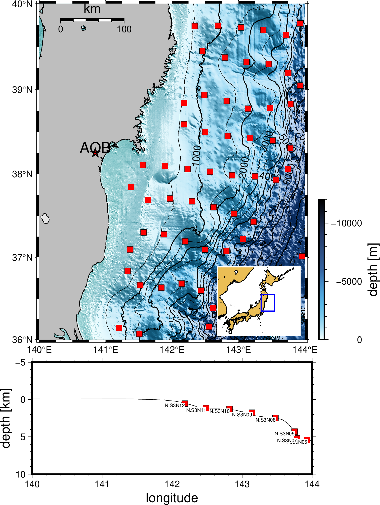
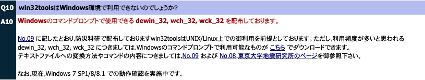

<!-- Last update @23/09/25) by K.Minamoto -->

<!-- @import "[TOC]" {cmd="toc" depthFrom=2 depthTo=6 orderedList=false} -->

# 地震波解析のための環境構築備忘録

<!-- code_chunk_output -->

- [本資料について](#本資料について)
- [事前準備](#事前準備)
  - [エディタ(OS共通)](#エディタos共通)
  - [仮想環境(Windows)](#仮想環境windows)
  - [Xwindow](#xwindow)
  - [Homebrew (Mac, Linuxユーザー)](#homebrew-mac-linuxユーザー)
  - [コマンド系 (Windows, 一部Linuxユーザー)](#コマンド系-windows-一部linuxユーザー)
  - [GNUコマンド系 (Macユーザー)](#gnuコマンド系-macユーザー)
  - [gnuplot](#gnuplot)
- [地震波形データの取得](#地震波形データの取得)
  - [HinetPyを使う場合](#hinetpyを使う場合)
  - [手動で行う場合](#手動で行う場合)
- [GMT](#gmt)
  - [GMTのインストール](#gmtのインストール)
    - [dmg, exeファイルなどから](#dmg-exeファイルなどから)
    - [Homebrewから](#homebrewから)
    - [ソースコードから（GMT6）](#ソースコードからgmt6)
    - [ソースコードから（GMT5）](#ソースコードからgmt5)
  - [GMT6記法のサンプル](#gmt6記法のサンプル)
- [Win32tool](#win32tool)
  - [Windows環境のインストール](#windows環境のインストール)
  - [Mac, Linuxでインストール](#mac-linuxでインストール)
- [WIN](#win)
  - [WINのインストール](#winのインストール)
  - [winで検測](#winで検測)
  - [波形を扱ってみる](#波形を扱ってみる)
  - [波形データを結合して扱う](#波形データを結合して扱う)
- [SAC](#sac)
  - [SACのインストール](#sacのインストール)
  - [SACファイルの処理](#sacファイルの処理)
- [謝辞](#謝辞)

<!-- /code_chunk_output -->

## 本資料について

* 地震波形を扱う上で必要となる**環境構築についての**備忘録です. 

* この資料の作成者はMacOS Monterey Ver12.4を使っています.　WindowsやUnix系に加え, IntelやM2チップを積んでいるMacOSで動くかは検証していません. なお, 最近のMacはデフォルトでzshですが, 今回はbashで実行しています. zshの方は`chsh -c /bin/bash`と打つとシェルを変えられます.

* 注意して作成しましたが, pdf版の場合コードブロックが途中で見切れている箇所があるかもしれません. その場合はhtml版を参照ください. 

* 本資料で解説するツールを使用した成果物には開発元の引用, 謝辞などが必要になる場合があるためご注意ください. 

* この文書をもとに発生した損害についての一切の責任を負いかねます. 

* 改良+二次配布のご協力をどうぞよろしくお願いします. 

## 事前準備

### エディタ(OS共通)
viやvimで問題ないですが, 個人的には~~Atomや~~VScodeやCursorをオススメします. 

### 仮想環境(Windows)
Windowsの方は, ストアでLinuxの仮想環境を入れるか, WSLの設定をすれば本資料のコードがある程度使えるはずです. 

管理者権限でPowerShellを開き以下を打つ.
```PowerShell
wsl --install # -dでディストリビューションを選択できる
```
一度PCを再起動して, また管理者権限でPowerShellに, 
```PowerShell
wsl
```
と打つと, 特にディストリビューションを指定しない場合, Ubuntuが起動する. ユーザー名とパスワードを入れるとLinuxが使える. 

その際, Debian系かRed Hat系かは確認しておきましょう. 筆者は専らUbuntuなので, この資料でLinuxと書いた場合はDebianです.

```sh
/mnt/c/Users/[ユーザー名]
```
でWindows側のフォルダにアクセスできるはずです. 

### Xwindow

SAC, WINを使う場合, Xwindow(MacOSであれば[Xquartz](https://www.xquartz.org/)が必要. 通常のソフトと同様の方法でダウンロードすればok. 


### Homebrew (Mac, Linuxユーザー)

[Homebrew](https://brew.sh/index_ja)を入れるとインストールが非常に楽です. Homebrewのサイト上に以下のようなコマンドがあります. 

```sh
/bin/bash -c "$(curl -fsSL https://raw.githubusercontent.com/Homebrew/install/HEAD/install.sh)"
```
これをターミナルに打つと, パスを通せといわれるので (言われない場合もある), 実行結果に記載されたパスを通すコマンドをコピーして, 再度ターミナルへ打つと完了します. 

```sh
which brew
```
で何某のパスが表示されればok. 

Homebrewを入れ終わったら, とりあえず以下を実行.
```sh
brew update # アップデート
brew upgrade # アップグレード
brew autoremove # 依存関係の見直し
brew cleanup # 不要ファイルの削除
```

### コマンド系 (Windows, 一部Linuxユーザー)

`make`  などのコマンドは入っていないこともしばしば (Macには入っている). その場合, Debian系なら`apt`で
```sh
sudo apt install build-essential
```
で`gcc`なんかと一緒にダウンロードできる. 
Red Hat系のディストリビューションでは`yum`で
```sh
yum install "Developer Tools"
```
なるものがあるらしい (yumは未検証). 

### GNUコマンド系 (Macユーザー)

MacはBSD系OSゆえ, ある程度のUnixコマンドはそのまま使えますが, オプションや引数などの使用が違うものもあります. GNUコマンドで書きたい場合は, 以下のようにします.

```sh
brew install coreutils
```

呼び出すには先頭にgnuの「g」をつける(e.g., date &rarr; gdate).

### gnuplot

homebrewなら, 
```sh
brew install gnuplot
```
で入ります.
とりあえず出力した結果を見るのに適しており, シェルスクリプト内でも, 

~~~bash
gnuplot << EOF
set terminal pngcairo  transparent enhanced font "arial,10" fontscale 1.0 size 600, 400 
set output 'world.1.png'
set format x "%D %E" geographic
set format y "%D %N" geographic
unset key
unset parametric
set style data lines
set yzeroaxis
set title "Gnuplot Correspondences\ngeographic coordinate system" 
set xrange [ -180.000 : 180.000 ] noreverse nowriteback
set x2range [ * : * ] noreverse writeback
set yrange [ -90.0000 : 90.0000 ] noreverse nowriteback
set y2range [ * : * ] noreverse writeback
set zrange [ * : * ] noreverse writeback
set cbrange [ * : * ] noreverse writeback
set rrange [ * : * ] noreverse writeback
set colorbox vertical origin screen 0.9, 0.2 size screen 0.05, 0.6 front  noinvert bdefault
NO_ANIMATION = 1
plot 'world.dat' with lines lc rgb "blue" ,
     'world.cor' with points lt 1 pt 2

EOF
~~~



といった感じで呼び出せます ([スクリプト元](https://gnuplot.sourceforge.net/demo/world.html)と[データ元](https://github.com/gnuplot/gnuplot/blob/master/demo/world.cor)).

## 地震波形データの取得

防災科研の**会員登録が必要**です. 

### HinetPyを使う場合

データはHinetPyでダウンロードできます. また, バージョン0.8.0以降は`0120B` (S-NET加速度計のLow Gain) が使えるようになります. 

```sh
python3 -m pip install HinetPy
# python3 -m pip install HinetPy==0.8.3
```

以下は「S-netの2022年3月16日23時20分から30分間のデータ」をとってくる例です. 

```python
from getpass import getpass
UserID = str(input('Username: '))
Password = str(getpass('Password: '))

from HinetPy import Client, win32
client = Client(UserID, Password,sleep_time_in_seconds=10)

client.info()

data, ctable = client.get_continuous_waveform('0120','202203162320',30)

# SACに変換する
win32.extract_sac(data, ctable, suffix='s', outdir='./sac')
win32.extract_sacpz(ctable, suffix='SAC_PZ', outdir='./sac_pz',)
```

### 手動で行う場合

手動でも防災科研HPから連続データを取得できます. 

<figure>
  
</figure>

## GMT

地図上のプロットが可能. 開発はPaul Wessel & Walter H. F. Smith. 

!!! tip GMT5とGMT6
    GMTはver5とver6で記法が大きく違います(先頭に「gmt」を必ずつける, `psxy`-> `gmt plot`に変更, `gmt subplot`が使える etc...). 
    
    GMT講習会ではGMT5を扱います(2022年現在)が, GMT6の方が簡単なのでオススメです. ただ現状, インターネット上のコードはほとんどGMT5の記法なので, 流用を考えている場合はver5の方がよいかもしれません. とはいえ, GMT6を入れてもGMT5の記法が使えるので, **ver6を入れる**と良いと思います. 
    ただし, ver 6.0.0ではplot3dに致命的なバグがあったり, ver 6.4.0にも`grdtrack`の引数に"**-A**zimuth"オプションを指定する場合にバグがあるっぽいです. 

### GMTのインストール

GMT (The Generic Mapping Tools) は[github](https://github.com/GenericMappingTools/gmt/releases)からダウンロードできます. 

#### dmg, exeファイルなどから

Macの場合は「.dmg」ファイルをダウンロードしてアプリケーションをドラッグ&ドロップで終了します. 起動はアイコンをクリックするだけ. 他OSに関しては, 例えばWindows(64 bit)なら「gmt-6.4.0-win64.exe」をダウンロードすれば終わると思います. 
その後, bashスクリプト内で`gmt`コマンドとして使いたい場合には, gmt起動後にターミナルに出る案内に従ってパスを通してください. 

#### Homebrewから

```sh
brew install gmt
```
ですんなり入ります. 

ダウンロード後に`ghostscript`と`imagemagic`と言われます (GMTを使っていて, psconvertで`returned error 79`が出る原因もこれに由来). 後にSACで作ったpsファイルをpdfにする際にも有用なので, この機会に入れておきましょう. 

先ほどと同様に
```sh
brew install ghostscript

``` 
で入ります. 

Homebrewからインストールした場合にはGMTのver6が入り, それ以前のバージョンはインストールされない (
加えて, GMT5でのインストールは既に廃止されている). 

NonLinLocやTauPツールなど, GMT4やGMT5のコマンドが必要になる場合には, ソースコードからのビルドが楽.

#### ソースコードから（GMT6）

[GMTのgithub](https://github.com/GenericMappingTools/gmt/releases)から tar ballをダウンロード（今回は最新版の`gmt-6.4.0-src.tar.gz`にする）.

基本的には`building.md`に従って実行するだけで, 必要なコマンドのみ抜粋したのが以下.

1. `ConfigUser.cmake`を作成し, その中身を編集する. 

    ```sh
    cp cmake/ConfigUserTemplate.cmake cmake/ConfigUser.cmake`
    ```

    * 13行目の`#set (CMAKE_INSTALL_PREFIX "prefix_path")`を, `set (CMAKE_INSTALL_PREFIX "/opt/gmt6")`にする. 
    * 17行目の`#set (GMT_INSTALL_MODULE_LINKS TRUE)`のコメントアウトを解除（'#'を消す）すると, GMT5のコマンドも入れる設定になる. 

1. `make`する
    `gmt-6.4.0/build`ディレクトリを作成する. 
    ```sh
    mkdir build
    cd build
    cmake ..
    ```
    以下, OSごとに違う. 
    ```sh
    # Linux/macOS/FreeBSD
    cmake --build .

    # Windows
    cmake --build . --config Release
    ```

    ```sh
    # Linux/macOS/FreeBSD
    cmake --build . --target install

    # Windows
    cmake --build . --target install --config Release
    ```

1. `$PATH`開通
    `/opt/gmt/bin`にパスを通す. 
    ```sh
    export PATH=$PATH:/opt/gmt6/bin
    ```
    GMT5のコマンドを入れた場合は, `pscoast`などのGMT5版でのコマンドが使えるかも確認. 

#### ソースコードから（GMT5）

1. `ConfigUser.cmake`を作成し, その中身を編集する. 

    ```sh
    cp cmake/ConfigUserTemplate.cmake cmake/ConfigUser.cmake`
    ```

    ```txt
    #set (CMAKE_INSTALL_PREFIX "prefix_path")
    ```
    を, 
    ```txt
    set (CMAKE_INSTALL_PREFIX "/opt/gmt5")
    ```
    にする. 

1. `src/common_sighandler.c`の63行目を, 
    ```c
    #   define UC_IP(uc) ((void *) (uc)->uc_mcontext->__ss.__pc)
    ```
    とする.

1. `make`する
    `build`ディレクトリと`ConfigUser.cmake`を作り, `build`ディレクトリで
    ```sh
    cmake ..
    make
    sudo make install
    make clean
    ```

1. `$PATH`を通す.


!!! info 「パス」とは
    やたらめったら出てくる「パス」ですが,「ディレクトリやファイルの位置」という意味の環境変数で, 「パスを通す」というのはOSにその場所を教えるという作業です. 

    あるコマンドを入力すると, PCはこのパスに書いてあるディレクトリ内を探して実行します. パスが通っていない場合 (かつフルパスを書かず, 単純にコマンドを入力した場合) にはカレントディレクトリ内を探すので, そのコマンドが存在するディレクトリ内であればコマンドは使えますが, それ以外では使えません. 別の言い方をすれば,「パスを通すことでコマンドの実行時にいちいちフルパスを書かなくてもよい」ということになります. 

    例えば, よく使う`ls`は, 
    ```sh
    which ls
    ```
    で確認すると, 
    ```shell-session
    /bin/ls
    ```
    にあります. 続いて

    ```sh
    echo $PATH
    ```
    と打つと環境変数`$PATH`の中身 ( = OSが探すディレクトリ)が表示され, ここに`/bin`が存在するので, どこでも`ls`が使えます. しつこいですが, 誤って`$PATH`を消してしまった場合 ( = パスが全く通っていない) でも, 
    ```sh
    /bin/ls
    ```
    とフルでパスを打てば実行できるわけです (でも, もし`$PATH`を消した場合は素直に復元しましょう).

    なお, `ls`が入っている`/bin`はシングルユーザモードでも利用できる重要なコマンドたちが格納されているので基本的にはイジりません. 自作のコマンドやダウンロードしたものは, `/usr/local/bin`に置くのが普通です. 

    また, よく「configureとmakeをすればインストールできる」と言いますが, `make`はコマンドとして存在する一方で, 「configure」というコマンドはありません. これはダウンロードしたディレクトリ内に「configure」という名前がつけられたコマンドが一緒に入っているため, そのディレクトリ内で使えるローカルなコマンド, ということになります. 一般的には名前を「configure」としていることが多いですが, モノによっては名前が違うので要確認です.


!!! note パスの通し方（ghostscriptの例）
    インストールしたパッケージの本体は`/usr/local/Cellar`にあり, `/usr/local/bin/`や`/usr/local/lib/`にシンボリックリンクが作られるらしい. 

    パスを通す必要がある場合, bashの人はbash_profile(隠しファイル)に以下の要領でパスを通す.
    ```sh
    vi ~/.bash_profile
    ```
    viで,
    ```sh
    export PATH=$PATH:/usr/local/Cellar/ghostscript/[バージョン]/bin
    ```
    を打ち込む. viを出て, 
    ```sh
    source ~/.bash_profile
    ```
    と打てば完了. 

    なお, gs ( = ghostscript)のバージョンは, 
    ```sh
    ls /usr/local/Cellar/ghostscript/
    ```
    で見に行ってください. 

    以上がうまくゆくと, psファイルを
    ```sh
    ps2pdf 変換前.ps 変換後.pdf
    ```
    でpdfに変換できます. 


### GMT6記法のサンプル

GMT5の例は講習会資料を参照. ここではGMT6のサンプルを載せます. 

海底地形 (出典: [日本海洋データセンター(JODC)](https://jdoss1.jodc.go.jp/vpage/depth500_file_j.html)) データを取得. 海に限らず, 全球の標高を描きたい場合は[ETOPO](https://www.ncei.noaa.gov/products/etopo-global-relief-model)などが使えます. 

上記サイトから, 今回は「経度:140~144, 緯度:36~40」の範囲をダウンロードしてきました. データの書式は, 

> データフォーマット
\
種別（0または1）、緯度（単位：度）、経度（単位：度)、水深（単位：ｍ）

となっているので, ここから必要な情報（緯度, 経度, 深さ）を書き出す. 深さ($4)にはマイナスをつけている. 
```sh
unzip [ダウンロードしたファイル.zip] > grid.txt

awk '{print $3,$2,-$4}' grid.txt > grid_cut.txt

# 最大/最小の緯度/経度を取得
x_max=`awk '{if(m<$1) m=$1} END{print m}' grid_cut.txt` \
x_min=`awk 'BEGIN{m=100000}{if(m>$1) m=$1} END{print m}' grid_cut.txt` \
y_max=`awk '{if(m<$2) m=$2} END{print m}' grid_cut.txt` \
y_min=`awk 'BEGIN{m=100000}{if(m>$2) m=$2} END{print m}' grid_cut.txt` \

region=${x_min}/${x_max}/${y_min}/${y_max}

# エイリアシングを防ぐため, blockmean (blockmedian, blockmode)を実行してからsurfaceで補完
gmt blockmean grid_cut.txt -I0.1m -R$region | \
gmt surface -I0.1m -R$region -Gtohoku-oki.grd
```

バイナリのグリッドファイル (tohoku-oki.grd) ができたので, 他の情報と合わせてプロットする. ここから標高データ(DEM)を抽出し, 角度「-A45 -Ne0.8」で陰影をつける. 「地震波形データの取得」で既にS-netのチャネルデータがあれば描画できます. 

```sh {.line-numbers}
#!/bin/bash

# グリッドの色, 太さ
gmt set MAP_GRID_PEN_PRIMARY 0.1,125/125/125

x_min=140
x_max=144
y_min=36
y_max=40

lat=39 # 断面図の緯度
surf=-5 # 上空
dep=10 # 深さ

range=$x_min/$x_max/$y_min/$y_max
z_range=$x_min/$x_max/$surf/$dep

# !a++: 重複列を削除
# tail: 1行目は空白のため, 2行目から処理
# channel.tmp: 経度, 緯度, -深さkm, 名前の順
awk '!a[$4]++{print $15,$14,-$16/1000,$4}' 01_20_20220316.euc.ch | tail -n +2 > channel.tmp
surface_grid=tohoku-oki.grd

gmt begin sample png
    # GMT6はsubplotが使える. 寸法は上図が10x12, 下図が10x4.
    gmt subplot begin 2x1 -Fs10/12,4
        gmt subplot set
        gmt basemap -JM -R$range -Bafg -BWSne
        # カラーパレットを作成
        gmt makecpt -Cabyss -T-12000/0/1000 -Z
        # grdデータを切り抜き, 勾配を計算, 等高線の表示
        gmt grdcut tohoku-oki.grd -R$range -Gdem.nc
        gmt grdgradient dem.nc -Ggrad.grd -A45 -Ne0.8
        gmt grdimage dem.nc -Igrad.grd -C
        gmt grdcontour dem.nc -A1000+ap+f10p,0,black -C500 -L-8000/100
        # スケールバー
        gmt coast -Df -Ggray -W0.5 -Lg140.8/39.8+c20+w100+f+l"km"
        # カラーバー
        gmt colorbar -DJBR+jBL+o0.5/0+w-5/0.2 -C -Baf+l"depth [m]" 
        # 予知観の位置
        echo 140.844457,38.251462 | gmt plot -Sa0.3 -Gred -W1,black
        echo 140.844457,38.25146,AOB | gmt text -F+f15p,0,black+jCB
        # S-netデータ
        awk '{print $1,$2}' channel.tmp | gmt plot -Gred -Ss0.3 -W0.1,black
        # 右下に図を挿入
        gmt inset begin -Dn0.66/0.01+w3/2.5 -F+gwhite+p0.2 -M0.05
            gmt set MAP_FRAME_TYPE = "plain"
            gmt basemap -R127/150/30/46 -Bxy
            gmt coast -Df -W0.5 -Glightbrown
            gmt plot -W1,blue -L << END
$x_min $y_min
$x_min $y_max
$x_max $y_max
$x_max $y_min
END
        gmt inset end
        
        # 断面図
        gmt subplot set
        gmt basemap -JX10/-4 -R$z_range -Bxafg+l"longitude" -Byafg+l"depth [km]" -BWSne
        # 断面図範囲を取得(0.1(-G)km(-Q)間隔)
        gmt project -C${x_min}/${lat} -E${x_max}/${lat} -G0.1 -Q > cross.tmp
        # 断面図の線に沿った高度を取得
        gmt grdtrack cross.tmp -Gdem.nc -fg > surface.tmp
        # (深さ)[m] -> -(深さ)[km]
        awk '{print $1,-$4/1000}' surface.tmp | gmt plot -W0.3,black
        # 断面図の水平線から, 30 km以内の観測点を取得
        gmt project channel.tmp -C141/39 -E144/39 -W-30/30 -Lw -Q > st_cross.tmp
        awk '{print $1,$3}' st_cross.tmp | gmt plot -Gred -Ss0.3 -W0.1,black
        awk '{print $1,$3,$8}' st_cross.tmp | gmt text -F+f5+jRT -Gwhite
    gmt subplot end
gmt end show

# 一時ファイルの削除
rm *.tmp
```
以下の画像「sample.png」が出力されるはずです. 

<figure>
  
  <figcaption>
  GMTによる東北沖の描画
  </figcaption>
</figure>

## Win32tool

防災科学技術研究所が提供するWin32形式 (Hinet, S-netなどのデータ) を扱うなら必要.

### Windows環境のインストール

機能が限られるものの使えるようです.



防災科研HPの[Q&A](https://www.hinet.bosai.go.jp/faq/?LANG=ja)の「Q10」参照. 

「こちら」をクリックすると, exeファイルがダウンロードされるので, コマンドプロンプトで, 
```sh
echo %path%
```
としてpathが通ったディレクトリを確認し, exeファイルをそこに移動. それ以外の機能が欲しい場合, 仮想環境を入れるなどして次の要領でインストールする. 

### Mac, Linuxでインストール

まずは[WIN32ツール](https://hinetwww11.bosai.go.jp/auth/manual/?LANG=ja)をダウンロード.

ツールが入ったら, Downloadsに移動して圧縮ファイルを解凍.
```sh
tar -xzvf win32tools.tar.gz
```

MacOSの場合, Downloads > win32tools > win2sac.src > s4read_data.c をエディタで開いて, 3行目の
```c
#include <malloc.h>
```
を以下のように編集;
```c
#include <stdlib.h>
```

とりあえず, ターミナルでmakeする.
```sh
make
make install
```

Win32ツール内のコマンド (`catwin32.src/catwin32`, `dewin.src/dewin`, `w32tow1.src/w32tow1`, `wadd.src/wadd`, `wch.src/wch`, `wchch.src/wchch`, `wck.src/wck`, `wed.src/wed`, `win2sac.src/win2sac`) をパスが通ったディレクトリに移す. 

## WIN

波形表示, フィルタ, 検測, 震源決定, データ型変換など, だいたいのことができる. 東京大学地震研究所が作成.

### WINのインストール

地震研のHP [Index of /WIN/pub/win](https://wwweic.eri.u-tokyo.ac.jp/WIN/pub/win/)から, 今回は「WIN_pkg-3.0.11.tar.gz」をダウンロード. 

MacOSの場合のみ, WIN_pkg-3.0.11/tools/TKY2JGDにある
+ delta.c
+ tky2jgd2ch1.c
+ tky2jgd2ch2.c
+ tky2jgdfinal.c
+ tky2jgd2map.c
の先頭に 
```c
#include <string.h>
```
を追記する. 追加で, もしかすると, 
```c
#include <malloc.h>
```
がある場合, 
```c
#include <stdlib.h>
```
に書き換える必要があるかもしれません. エラーを確認して下さい. 

その後は基本的にはREADMEに従って, ダウンロードしたディレクトリ内で, 
```sh
./configure --prefix=/usr/local/win
make
make install
```
の順に実行する. 

`make install`で, 
```shell-session
mkdir: /usr/local/win: Permission denied
```
なるエラーが出ますが, 単純なpermission errorなので, 
```sh
sudo make install
```
で実行できて, 終わったら 
```sh
/usr/local/win/bin
```
にパスを通せばok. 

続いて, 事前準備でダウンロードしたXwindowを立ち上げておく. 
そしたらターミナル上で
```sh
xwininfo -int
```
と打つと, 
```shell-session
xwininfo: Please select the window about which you
          would like information by clicking the
          mouse in that window.
```
という表示がでるので, 立ち上げておいたXwindowをマウスでクリックする. ターミナル上に
```shell-session
xwininfo: Window id: 6291468 "xterm"
```
のように表示されるので, この「6291468」にあたる部分をコピー. 環境変数を設定する. 
```sh
export WINDOWID=6291468
```
をbash_profileに書いて更新すると, ようやくwinを起動できる. 

試しに, 
```sh
cd etc
win 991109.064607
```
とすると波形が表示される. 

<figure>
  
  <figcaption>
  WINによる描画
  </figcaption>
</figure>

### winで検測

<!-- 先ほど拾ってきたデータ(Win32形式)を使う場合, Win32tools内のコマンド「w32tow1_32」が必要です.  -->

Winを使うには, 以下のファイルが必要です. 

* win.prm 
  ```txt
  win-file  	            /* data directory */
  0120_20220316.ch	            /* channel table */
  zones.tbl	            /* zone file */
  pickfile    	            /* picks directory */
  /usr/local/win/bin/hypomh	    /* hypomh program */
  struct.tbl	            /* structure model */
  map.japan.km	            /* map file */
  .	                    /* output directory */
  B4	                    /* output format (B4/B2/L4/L2) */
  filter.prm	            /* filter file */
  &                           /* printer name */
  lower                       /* projection */
  labels.tbl	            /* labels file */
  .	                    /* hypocenters file */
  100.0	                    /* printer's DPI */
  /tmp	                    /* working directory */
  ```

* tmp
空のディレクトリ

* pickfile
空のディレクトリ

* struct.tbl (ファイル)
  ```txt
  35.5      139.5     30.0
      6 ABC
  5.50      5.51      6.10      6.11      6.70      6.71      8.00
  8.20
  4.00      0.01      10.60     0.01      16.90     0.01      600.0
  5.0       100.0     100.0     30.0

  ```

先ほどHinetPyで拾ってきた30分間のデータが「0120_202203162320_30.cnt」に既にまとめられてるので, 
```sh
w32tow1_32 0120_202203162320_30.cnt 20220316.232000_30
```
としてwinファイルに変換する. 

```sh
win -abwt 20220316.232000_30
```
とすると自動で検測を行い, その結果が「pickfile」に入る. エラー（特にセグフォ）が出る場合はディレクトリ (`picfile`や`tmp`) が作成されているか確認してください.

### 波形を扱ってみる

先ほどダウンロードしたS-netのデータを扱ってみます. 適当にディレクトリを作成して, 解凍したデータを移動します. 「.ch」という名前のファイルをエディタで開く. 

もしMacで, 

```shell-session
There is no application set to open the document “ファイル名.ch”.
```

というエラーが出ても, 「アプリケーションを選択」でテキストエディタを選択すれば開けます. 「.ch」の前の「euc」や「sjis」は文字コードで, 文字化けしている場合はエディタの文字コードが対応しているか確認してください. 

```txt
e009  1  0 N.S1N01  VX     1 24     57.6 m/s     1  1  0  3.296E-08  35.8968  141.0535  -169  0  0  N.s1n01
e00a  1  0 N.S1N01  VY     1 24     53.7 m/s     1  1  0  3.296E-08  35.8968  141.0535  -169  0  0  N.s1n01
e00b  1  0 N.S1N01  VZ     1 24     54.2 m/s     1  1  0  3.296E-08  35.8968  141.0535  -169  0  0  N.s1n01
```

上の例では, N.S1N01観測点のVX, VY, VZ方向のデータがe009, e00a, e00bという16進数で表された名前で入っている. 

例えば, 2022年3月16日23時30分 (から1分間) の観測点コード0120 (S-net) のN.S1N01観測点の上下動成分 (e009) のテキストファイルが欲しい場合は, Win32形式(.cnt)のデータにdewin_32コマンドを使って, 

```sh
dewin_32 -c e009 2022031623300120VM.cnt > e009.txt
```

とすればtxtファイルが生成される. 波形はこんな感じ. 

```sh
# gnuplot
set terminal png
set output 'e009.png'
set xlabel 'time'
set title 'e009'
plot 'e009.txt' with line
```

<figure>
  
</figure>

### 波形データを結合して扱う

波形を結合し, 連続データとして扱います. 以下の例ではWin32をSACファイルにしていますが, 変換するファイルによってコメントアウトを解除してください.　

```sh
#!/usr/bin/bash

# win2ascii.sh
In=win-file # Win32ファイルのあるディレクトリ
Ch=`find $In -name *.ch` # *.sjis.ch でも可

Out=dewin-file # 出力先ディレクトリ名
mkdir -p $Out # なければディレクトリを作成

catwin32 $In/*.cnt > data_win32.tmp # win32ファイルを結合

########################
# 以下, 用途に応じて変える #
########################

# win32 -> win
# w32tow1 data_win32.tmp > data_win.tmp

# チャネル番号でループ
awk '{print $1}' $Ch | while read Hex; do
  # win32 -> txt
  # dewin_32 -c $Hex data_win32.tmp > $Out/${Hex}.txt

  # win32 -> sac
  win2sac_32 data_win32.tmp $Hex sac $Out

  # win -> sac 
  # win2sac_32 data_win.tmp $Hex sac $Out

  # win -> sac
  # cat data_win.tmp | shmdump -tq - $Hex | wintosac -t $Ch -d $Out $Hex
done
```

ちなみに周波数フィルタもここでかけられます. 先ほどのwin2ascii.shの中を

```
dewin_32 -c -f [filter.prmのパス] filter.prm ~
```

に書き直し, 以下をfilter.prmとして保存. 

```txt
# filter.prm
# hpf fp=10.0 fs=5.0          ap=0.5 as=5.0
# lpf fp=0.5  fs=0.8          ap=0.5 as=5.0
bpf fl=2.0  fh=8.0 fs=10.0 ap=0.5 as=5.0
```

ハイパス(hpf), ローパス(bpf), バンドパス(bpf)があるが, 使わないものは「#」でコメントアウトする. 上に書いた例ではbpf (通過域:2~8 Hz, ストップバンド10 Hz) をかけている.

## SAC

波形をみる, フィルタをかける, 相関をとる, 粒子軌跡をみる, ダウンサンプリング, 地震計特性の補正, 粒子軌跡なんかもできる.
Lawrence Livermore National Laboratoryで開発. 現在はIRIS.

### SACのインストール

[IRISのサイト](http://ds.iris.edu/ds/nodes/dmc/forms/sac/)に必要事項を記入し, 申請. 数日すると許可のメールがくるので, **7日間以内**にメール内のリンクにアクセス, SACをダウンロード. 

```sh
export SACAUX=/usr/local/sac/aux
export SACGRAPHICS=xwindows
PATH=$PATH:/usr/local/sac/bin
```
をbash_profileに書き込む. 

あとは`/usr/local/sac`ディレクトリを作り, 解凍したSACをそこに移す.

起動は

```sh
sac
``` 

だが, Macの場合「開発元の~」とエラーが出る. 「システム環境設定」&rarr; 「セキュリティとプライバシー」に入って, 鍵マークをクリック. パスワードを入れたら「このまま許可」を押す. 再度鍵をかけることを忘れずに. もう一度sacを実行すると, またエラーが出るが「開く」を押せば実行できる. 

### SACファイルの処理

先ほど作成した各観測点のsacファイルをイジってみる.

```sh
sac
```
で起動し, 波形を表示する. 
```sh
r ./dewin-file/N.S3N06.V*   # readでも可
bp bu c 2 8 p 2             # 2~8Hzのbpfを往復でかける
p1                          # plot1でも可
```
画像を保存する.
```sh
bd sgf
p1
sgftops f001.ps
```
これでpsファイルができた. このままghostscriptのコマンドで, 
```sh
ps2pdf hoge.ps hoge.pdf
```
とすると, 以下のpdfが保存される.

<figure>
  
  <figcaption>
  .sacファイルの描画
  </figcaption>
</figure>


## 謝辞

本資料の作成にあたり, 以下のデータやツールを使用させていただきました. 感謝申し上げます. 

[防災科研ホームページ](http://www.hinet.bosai.go.jp/)のS-net波形データを使用いたしました. 

地図などのグラフはGMT6を用いて作成しました. 

>Wessel, P., Luis, J. F., Uieda, L., Scharroo, R., Wobbe, F., Smith, W. H. F., & Tian, D. (2019). The Generic Mapping Tools version 6. Geochemistry, Geophysics, Geosystems, 20, 5556–5564. https://doi.org/10.1029/2019GC008515

海底地形は[海上保安庁ホームページ](https://www.jodc.go.jp/jodcweb/index_j.html)のデータを用いました. 

<p style="text-align: right">
<small>&copy;2024 K.M.</small>
</p>
